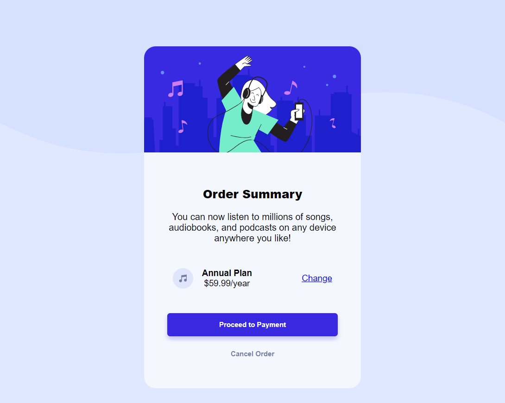

# Frontend Mentor - Order summary card solution

This is a solution to the [Order summary card challenge on Frontend Mentor](https://www.frontendmentor.io/challenges/order-summary-component-QlPmajDUj). Frontend Mentor challenges help you improve your coding skills by building realistic projects. 

## Table of contents

- [Overview](#overview)
  - [The challenge](#the-challenge)
  - [Screenshot](#screenshot)
  - [Links](#links)
- [My process](#my-process)
  - [Built with](#built-with)
  - [What I learned](#what-i-learned)
  - [Continued development](#continued-development)
  - [Useful resources](#useful-resources)
- [Author](#author)
- [Acknowledgments](#acknowledgments)


## Overview

### The challenge

Users should be able to:

- See hover states for interactive elements

### Screenshot

Desktop


Mobile screenshot


### Links

- Solution URL: [https://github.com/digitalocean2345/FEMproject3_OrderSummaryComponent]
- Live Site URL: [https://digitalocean2345.github.io/FEMproject3_OrderSummaryComponent/]

## My process

### Built with

- Semantic HTML5 markup
- CSS custom properties
- Flexbox


### What I learned

Key learnings:
- how to apply background image using background: url('link') 
- the plan anchor element was placed using margin-left:auto which means that it will take all the available space on left for the margin

```css
.plan-anchor{
    margin-left: auto;
    font-size: 15px;
}
```

## Author

- Frontend Mentor - [@digitalocean2345](https://www.frontendmentor.io/profile/digitalocean2345)

